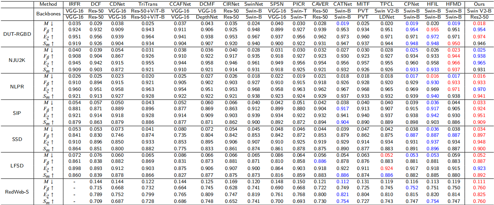
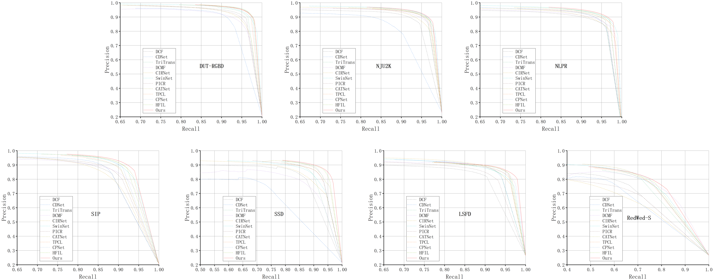

# Asymmetric Deep Interaction Network for RGB-D Salient Object Detection

## 1. Overview
### 1.1. Introduction
In recent years, most of the existing RGB-D SOD models use summation or splicing strategies to directly aggregate information from different modalities and decode features from different layers to predict saliency maps. However, they ignore the complementary properties of depth images and RGB images and the effective use of features between the same layers, resulting in a degraded model performance. To address this issue, we propose an asymmetric deep interaction network (ADINet) with three indispensable components with a focus on information fusion \& embedding. Specifically, we design a cross-modal fusion encoder  for enhancing the information fusion \& embedding on semantic signals that is employed to benefit from the mutual interaction of RGB and depth information. Then, we propose a global-and-local feature decoder to enrich the global \& local information for improving the recognition of salient objects. We have conducted the experiments on seven RGB-D benchmarks, and the results demonstrate that the proposed method is superior to or competitive with the state-of-the-art works.

### 1.2. Framework Overview

Figure 1: Overall architecture of the proposed ADINet

### 1.3. Quantitative Results

Figure 2: Quantitative Results

### 1.4. PR Curves

Figure 3: PR Curves

### 1.5. Qualitative Results

Figure 4: Qualitative Results

## 2. Data Preprocessing
The training and testing experiments were conducted using PyTorch with a single Tesla T4 GPU 16GB.
### 2.1. Requirements
python 3.8,   pytorch 1.10.0
### 2.2. Prepared Datasets
* Download the training dataset and move the train files from it into ./train, and the val files into ./val, which can be found from [Baidu Drive](https://pan.baidu.com/s/1wfOG3EqyLaM0UH6pwfvpdA)(extraction code: o3o4).
- Downloading testing datasets from [Baidu Drive](https://pan.baidu.com/s/1uERpDsb9GIvCACOoCXeJSg)(extraction code: 211k).
* Downloading Swin V2 weights ([Swin V2](https://pan.baidu.com/s/1_zZIHiBFOHXZ-F-cJohKTQ)(extraction code: 6hyq)) and move it into [./pretrain/swinv2_base_patch4_window16_256.pth].

## 3. Training and Testing
### 3.1. Training
`python train_ADINet.py`
### 3.2. Testing
`python test_ADINet.py`\
For training and testing purposes, the following operations can be performed: `python run_ADINet.py`

## 4. Results
We provide saliency maps of ADINet on seven benchmark RGB-D SOD datasets, including: DUT-RGBD, NJU2K, NLPR, SIP, SSD, LFSD and RedWeb-S from [Baidu Drive](https://pan.baidu.com/s/12VpO5Z79MqM7wvJKup7Aqw)(extraction code: ADIN). In addition, we provide the prediction results for RGB-T SOD [Baidu Drive](https://pan.baidu.com/s/1o3bFZ1EU72qLP4XC3u9XLw)(extraction code: 06h9) and RGB SOD [Baidu Drive](https://pan.baidu.com/s/1bkRwGe-RmhczEbojx1_J1g)(extraction code: wbw3).

## 5. Evaluating Results
When training is complete, the predictions for the test set are saved in . /test_maps. We provided [python versions](https://pan.baidu.com/s/1Y1bn4ITcWAOqp-43SNVJbg)(extraction code: dr6d) for evaluation.\
`python main.py`

## 6. Acknowledgement
Thanks to [RFNet](https://github.com/Zongwei97/RFnet) for their excellent work.
## Note
Our core code is being organized and will be uploaded later!
